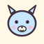

<div align="center">



# ✿ urufulabs studio ✿

> **Status:** live
> _last updated: 2026-08-17_

⌒ browser-based generative NFT art tool ⌒
_ブラウザで、10,000体まで、CIDでハンドオフ_

[](https://nextjs.org/)
[](https://react.dev/)
[](#-data-storage-)
[](#-how-it-works-)
[](./LICENSE)

</div>

<div align="center">

[**◦ the app** ](/studio) ・ [**◦ how-to** ](/how-to) ・ [**◦ launchpad** ](https://github.com/urufu-labs/urufu-launchpad) ・ [**◦ urufu labs** ](https://github.com/urufu-labs)

</div>

<br />

> This repository is the source for **urufulabs studio** — a client-side
> generative art studio for chibi PFP-style collections. Upload trait layers,
> tune weights and rules, generate up to 10,000 unique tokens entirely in the
> browser, curate the results, and publish to IPFS with a single CID handoff.
> No wallet needed to create.

---

## ✿ table of contents ✿

- [overview 概要](#-overview-)
- [features 機能](#-features-)
- [how it works 仕組み](#-how-it-works-)
- [quickstart はじめに](#-quickstart-)
- [env vars 環境変数](#-env-vars-)
- [data storage データ保存](#-data-storage-)
- [repo layout レイアウト](#-repo-layout-)
- [design system 意匠](#-design-system-)
- [extending 拡張](#-extending-)
- [roadmap ロードマップ](#-roadmap--limitations-)
- [in the family 家族](#-in-the-family-)
- [license 版権](#-license-)

---

## ⌒ overview ⌒

urufulabs studio turns a folder of PNG trait layers into a full generative
collection, entirely in the browser. drop your layers in, adjust rarity
weights and rules, hit generate, and the studio composites every token with
an OffscreenCanvas worker. curate the results — reroll a bad roll, swap a
trait, add a one-of-one — then publish to IPFS with one click.

nothing leaves the device until the user hits publish. no server-side asset
storage, no wallet integration, no lock-in.

designed as a sibling product to
[urufu-launchpad](https://github.com/urufu-labs/urufu-launchpad): the two
share a visual language, and studio-produced CIDs plug straight into a
launchpad drop.

---

## ♡ features 機能 ♡

- **✿ 100% client-side** — trait PNGs, generated tokens, and every knob live in the user's browser. nothing leaves until publish.
- **✿ browser-persistent** — OPFS + IndexedDB retain projects across sessions and reloads. no server, no account, no lockout.
- **✿ up to 10,000 tokens** — OffscreenCanvas worker with batched rendering handles a full 10k drop without freezing the UI. progress + ETA + cancel.
- **✿ weighted rules** — per-trait rarity weights plus a single collection ruleset covering always/never layers, per-layer chance, trait pairs, and layer exclusions.
- **✿ post-generation curation** — virtualized collection browser, single-token reroll, per-token trait swap with live preview, delete.
- **✿ one-of-one tokens** — upload a finished PNG or hand-compose from your trait pool. custom name/description/attributes. survives regenerate.
- **✿ IPFS publishing** — one-click directory pin of images then metadata returns one baseURI-compatible metadata CID ready to hand off to a launchpad or contract. images CID is available as a secondary reference.
- **✿ no wallet needed to create** — minting is out of scope. the studio produces the CID and stops there.

---

## ⌒ how it works ⌒

### ✿ the trait library

users add trait art via drag-and-drop (folder-of-subfolders, one subfolder
per layer) or a file-picker with `webkitdirectory`. each subfolder becomes a
**layer** (e.g. `background`, `body`, `eyes`, `hat`); each PNG inside becomes
a **trait**. traits carry an editable `displayName` (used in metadata) that
is independent of the filename, plus a per-trait weight.

upload UI lives in
[`components/upload-dropzone.tsx`](components/upload-dropzone.tsx); the
storage side in [`lib/storage/asset-store.ts`](lib/storage/asset-store.ts).

### ✿ layer order + rendering

layers composite back-to-front: layer 0 is the background, the last layer is
the topmost. all traits should share the same canvas size with a transparent
background so they stack cleanly. the studio computes render size from the
first trait it loads.

### ✿ rules (single template)

rules live in [`lib/art-generator/rules.ts`](lib/art-generator/rules.ts):

```ts
interface CollectionRules {
  template: CollectionTemplate;
  traitPairs: TraitPair[];
  layerExclusions: LayerExclusion[];
}

interface CollectionTemplate {
  alwaysLayerIds: string[];        // layers that must appear
  neverLayerIds: string[];         // layers always skipped
  excludedTraitPaths: string[];    // specific traits to never roll
  layerRules?: Array<{             // per-layer overrides
    layerId: string;
    chancePercent: number;         // e.g. "40% of tokens skip the hat layer"
    excludeLayerIds: string[];     // cross-layer skips when this layer rolls
  }>;
}
```

global (shared) rules:

- **trait pairs** — when trait A rolls, force trait B (and vice versa).
- **layer exclusions** — when a source layer rolls anything, skip these
  target layers.

> the previous two-template A/B split (`templateA` / `templateB` /
> `templateAWeight`) has been removed. legacy saved configs are auto-migrated
> to the single-template shape via `normalizeCollectionRules` (prefers
> `templateA`'s rules, falls back to `templateB` if only that side existed).

### ✿ rarity weights

each trait carries a non-negative integer weight (default 10). weights bias
`pickWeightedTrait` per layer. set a weight to 0 to exclude a trait entirely
without deleting it.

### ✿ capacity + simulation

the stats panel computes:

- **capacity** — deterministic upper bound: product of viable traits per
  non-`Never` layer, accounting for chance-based optional layers.
- **simulated unique** — runs the actual weighted roll up to `target × 1.5`
  attempts and counts unique fingerprints. catches cases where capacity says
  "10k possible" but weights make most rolls collide.

### ✿ generation (worker + OffscreenCanvas)

generation runs in a web worker with OffscreenCanvas — see
[`lib/workers/generator.worker.ts`](lib/workers/generator.worker.ts). traits
decode to `ImageBitmap` on the main thread and are transferred into the worker
by reference. the worker:

- batches renders (25 tokens/tick default) and yields between batches.
- uses a seeded RNG so runs are reproducible.
- caps target at **10,000**; caps attempts at `max(1000, target × 30)`.
- emits `progress` (done / total / elapsed / eta), `token` (id + composite
  Blob + selected traits per layer), `done`, and `error` messages.
- supports abort via `{type:'abort'}` inbound.

the orchestration layer
([`components/collection-generator.tsx`](components/collection-generator.tsx))
handles token-ID assignment on the main thread. before starting a run it
reads the set of **static (1-of-1) token IDs**, reduces the worker's
`targetSize` by the static count, and assigns each incoming worker token to
the next available non-reserved ID. that means 1-of-1s can be added at any
point — before, during-a-pause, or after generation — and a subsequent
regenerate never collides with their IDs.

live UI during a run: `.uru-num` counters, rate/sec, ETA, a strip of the last
6 rendered thumbnails, and a `.uru-btn-danger` Cancel that leaves already-saved
tokens intact.

### ✿ post-generation curation

the **collection browser**
([`components/collection-browser.tsx`](components/collection-browser.tsx)) sits
between the generator and the IPFS panel. virtualized with CSS
`content-visibility: auto` + `contain-intrinsic-size` — 10k tiles render
without lag and no external virtualization library.

from the browser: filter by layer or specific trait, sort by token ID asc/desc
or "1-of-1s first", jump to a specific token ID, click any tile to open a
detail overlay with the full-size image, attributes list, and per-token
actions:

- **reroll** — new random combination for the same ID, same rules engine.
- **swap traits** — a modal per layer with live preview and save
  ([`components/token-swap-editor.tsx`](components/token-swap-editor.tsx)).
- **delete** — drop this token.

static (1-of-1) tokens hide the Reroll button and show a pink `1/1` stamp.

### ✿ 1-of-1 tokens

add via **Add 1-of-1 ✿** in the browser toolbar
([`components/one-of-one-panel.tsx`](components/one-of-one-panel.tsx)):

- **upload mode** — pick a fully-composed PNG.
- **compose mode** — hand-pick specific traits from the current layers with a
  live preview.

fill in a custom `name`, `description`, and any `{ trait_type, value }` rows.
static tokens are appended at `maxTokenId + 1`, marked `isStatic` in storage,
and survive regenerate (the studio prompts *keep 1-of-1s* vs *wipe
everything* on regenerate).

### ✿ IPFS publishing

the publish flow ([`lib/ipfs/pinata.ts`](lib/ipfs/pinata.ts)) uploads in two
directory phases:

1. **images directory** — every output blob is pinned as one IPFS directory
   in a single request. the response gives the `imageCid`.
2. **metadata directory** — per-token ERC-721 JSON is generated referencing
   `image: "ipfs://{imageCid}/{tokenId}.png"`, then all metadata JSONs are
   pinned as a second IPFS directory. the response gives the `metadataCid`.

the resulting shape matches what every ERC-721 launchpad and marketplace
(OpenSea, Blur, Magic Eden) expects:

```
metadataCid/
  1.json
  2.json
  ...

imageCid/
  1.png
  2.png
  ...
```

`tokenURI(1)` → `ipfs://metadataCid/1.json`, which contains
`image: "ipfs://imageCid/1.png"`.

the final panel shows one hero pill for the metadata CID (`copy CID`,
`copy ipfs://`, `open on gateway ↗`) with a small toggle underneath revealing
the image folder CID for anyone who wants to browse the raw pngs.

1-of-1 metadata honors the custom fields: `customName` overrides the default
`${collectionName} #${tokenId}`, `customDescription` overrides the
collection-level description, `customAttributes` merge over algorithm-derived
attributes by `trait_type` (custom wins on conflict), then
`{ trait_type: "edition", value: "1 of 1" }` is appended.

server-side, [`app/api/ipfs/mint-jwt/route.ts`](app/api/ipfs/mint-jwt/route.ts)
mints a scoped upload key from the operator's `PINATA_JWT`;
[`app/api/ipfs/proxy-upload/route.ts`](app/api/ipfs/proxy-upload/route.ts)
serves as a fallback path for free-tier accounts. the UI shows a neutral
"IPFS uploads are temporarily unavailable" bubble when the operator hasn't
configured a JWT — no provider name is surfaced to users.

---

## ♡ quickstart ♡

```bash
pnpm install
pnpm dev
```

open <http://localhost:3000/studio>. `/` renders the landing shell; the
walkthrough is at <http://localhost:3000/how-to>.

**no environment variables are required** for creating and generating a
collection. to enable the "Publish to IPFS" button, set `PINATA_JWT` in a
`.env.local` (see [env vars](#-env-vars-) below). the JWT is
operator-configured and never surfaced to users.

for a step-by-step user walkthrough (upload → tune → generate → curate →
publish), open `/how-to` in the running app.

---

## ⌒ env vars ⌒

from [`.env.example`](.env.example):

- `PINATA_JWT` *(server-only, optional)* — enables the "Publish to IPFS"
  button. not required for creation or generation. configured by the
  operator; never surfaced to users.

> the previous `NEXT_PUBLIC_ENABLE_STUDIO` gate has been **removed**. the
> studio is always enabled; there is no dev-tools flag to toggle.

---

## ✿ data storage ✿

all user data is local to the browser. nothing is written to the repo's
`data/` directory or any server at runtime.

- **OPFS** (`navigator.storage.getDirectory()`, wrapped in
  [`lib/storage/opfs.ts`](lib/storage/opfs.ts)) — trait PNGs and generated
  token blobs.
- **IndexedDB** (via `idb-keyval`, wrapped in
  [`lib/storage/db.ts`](lib/storage/db.ts)) — project metadata: layers,
  traits, rules, weights, config, output records.

path scheme in OPFS:

```text
projects/{projectId}/traits/{layerDir}/{traitFileName}
projects/{projectId}/outputs/{tokenId-padded-to-6}.png
```

the IndexedDB schema is versioned (`SCHEMA_VERSION = 3` at time of writing).
migrations run automatically on load — v1→v2 collapsed the template A/B split
to the single-template shape; v2→v3 added the `isStatic` / `customName` /
`customDescription` / `customAttributes` fields to `StoredOutput`.

users can hold multiple named projects; the active one is tracked under
`neochibi:active-project`. switching, duplicating, renaming, and deleting
projects is supported via the AssetStore surface.

---

## ⌒ repo layout ⌒

```text
app/
  page.tsx              landing shell
  studio/               studio page (App Router)
  how-to/               user walkthrough (numbered polaroid steps + FAQ)
  api/ipfs/             mint-jwt + proxy-upload (only server routes)
  layout.tsx            root shell: fonts, theme bootstrap, mascot, audio
  globals.css           Tailwind v4 + .uru-* utility layer + tokens
components/
  art-generator-studio.tsx     main studio client component
  collection-generator.tsx     generation panel + worker orchestration
  collection-browser.tsx       virtualized post-gen browser + detail overlay
  token-swap-editor.tsx        per-token trait swap modal
  one-of-one-panel.tsx         1-of-1 upload / compose modal
  upload-dropzone.tsx          drag-drop + file-picker trait intake
  ipfs-push-panel.tsx          publish flow + CID pills
  preview-canvas.tsx           live composite preview
  gallery-tile.tsx             reroll-preview tiles
  trait-picker.tsx             per-layer trait picker
  studio-steps.tsx             workflow progress strip
  shell/
    site-header.tsx            cream header + brand mark ウ + theme + audio
    site-footer.tsx            dashed-top pixel-font footer
    mobile-navigation.tsx      right-side drawer + module.css
    theme-toggle.tsx           light/dark toggle
    audio-toggle.tsx           SFX on/off toggle
    cursor-mascot.tsx          wolf sprite following the cursor
    mascot.tsx                 SVG mascot component
    audio-bindings.tsx         document-level SFX event delegation
lib/
  storage/              OPFS + IndexedDB layer (opfs, db, asset-store)
  art-generator/        pure rules engine, weights, effects, presets
    pure/               render-token: pure single-token compositor
  workers/              generator.worker.ts (OffscreenCanvas 10k pipeline)
  ipfs/                 pinata client helper
  audio/                sfx.ts (procedural WebAudio)
public/
  theme-bootstrap.js    pre-hydration data-theme setter
docs/
  art-studio.md         implementation notes + export manifest shape
test/                   node-native unit tests (no jest, no vitest)
```

> removed since the earlier filesystem-backed iteration:
> `app/api/art-generator/*` (nine routes), `lib/dev-tools-flag.ts`,
> `app/studio/layout.tsx`, `lib/art-generator/{config-store,library,root,weights-store}.ts`.
> all replaced by the client-side AssetStore over OPFS + IndexedDB.

---

## ♡ design system ♡

urufulabs studio and
[urufu-launchpad](https://github.com/urufu-labs/urufu-launchpad) share a
design language: kawaiicore / Sanrio-2002 scrapbook — cream paper base,
mauve-charcoal ink, pink-hot / mizuiro / mint / yolk pastel accents, double-
and dashed-border shells, chunky pixel-offset drop shadows, tape strips, and
postage-stamp badges.

the visual system:

- **Tailwind v4** (`@tailwindcss/postcss`) plus a hand-rolled `.uru-*`
  utility layer in [`app/globals.css`](app/globals.css) (shells, polaroids,
  tape, stamps, buttons, chips, inputs, num, list-flower, bubble, marquee).
- **five Google fonts** via `next/font/google`: Yusei Magic (display), Klee
  One (round), Pixelify Sans (labels/stamps), DotGothic16 (JP accents),
  JetBrains Mono (numbers).
- **theme-aware tokens** (`--cream`, `--anchor`, `--pink-hot`, …) switched
  by a `data-theme` attribute on `<html>` and a pre-hydration bootstrap
  script (`public/theme-bootstrap.js`) that avoids FOUC.
- **cursor mascot + audio bindings** — ambient character mounted from
  [`app/layout.tsx`](app/layout.tsx).

---

## ⌒ extending ⌒

```bash
pnpm typecheck    # tsc --noEmit
pnpm test         # node --import tsx --test test/*.test.ts (no jest, no vitest)
pnpm build        # next build
pnpm dev          # next dev on :3000
```

the rules engine and effects pipeline are pure modules — no React, no
filesystem. import them directly:

```ts
import {
  DEFAULT_RULES,
  normalizeCollectionRules,
  simulateCollection,
  type CollectionRules,
} from 'neochibi-studio/lib/art-generator/rules';
import { pickWeightedTrait } from 'neochibi-studio/lib/art-generator/rules';
import { renderToken } from 'neochibi-studio/lib/art-generator/pure/render-token';
```

for a recommended export-manifest shape (ordered trait stack per generated
slot), see [`docs/art-studio.md`](docs/art-studio.md).

### ✿ adding an effect

1. implement the filter in `lib/art-generator/canvas-filters.ts` and add it
   to `DEFAULT_PREVIEW_EFFECTS` with a default `enabled: false`.
2. add a preset (optional) to `PREVIEW_EFFECT_PRESETS` so it shows up in the
   gallery preset list.
3. reference the effect ID anywhere — the studio handles persisting its
   options through `normalizePreviewEffects`.

### ✿ extending the rules engine

rules live in `lib/art-generator/rules.ts`. each rule type has its own
normalizer (so garbage configs round-trip cleanly) and is applied inside the
roll function. new rules should:

- add a normalizer that survives unknown fields.
- be applied deterministically (no calls to `Math.random` outside the
  passed-in `rng`).
- live under the single `CollectionRules` shape (no reintroducing A/B splits).
- have a test in `test/rules.test.ts`.

### ✿ adding an IPFS provider

the publishing helper in [`lib/ipfs/pinata.ts`](lib/ipfs/pinata.ts) follows a
two-part pattern:

1. **server-side JWT / auth issuance** in `app/api/ipfs/mint-jwt/route.ts` —
   reads the operator secret from env, returns a short-lived scoped token
   (or a `{proxyMode:true}` fallback).
2. **client-side upload helper** — iterates OPFS outputs, uploads via
   `FormData` multipart, reports progress, returns CIDs.

to add another provider (Storacha, Filebase, etc.), mirror those two pieces
and swap the client call sites. the UI should stay provider-agnostic — no
brand names in `components/ipfs-push-panel.tsx`.

---

## ⌒ roadmap / limitations ⌒

- **same-device only.** projects live in the current browser origin.
  cross-device sync is not yet implemented.
- **storage bounded by OPFS quota.** browsers typically allow ~5 GB; large
  collections with high-resolution art can approach that.
- **PNG only.** traits must be `.png`. SVG and animated formats are not
  supported.
- **single canvas size.** all traits should share the same dimensions and
  transparent backgrounds; mismatched sizes will misalign.
- **no wallet integration.** the studio produces images + metadata + CIDs
  and stops. minting happens elsewhere.
- **no undo stack.** autosave to IndexedDB is the only history. use git for
  code-level rollback; export config presets for design-level rollback.

---

## ♡ in the family 家族 ♡

- **[✿ urufu-launchpad](https://github.com/urufu-labs/urufu-launchpad)** — the composable token launchpad. studio-produced CIDs plug directly into a launchpad drop.
- **[✿ urufu-gemu](https://github.com/urufu-labs/urufu-gemu)** — the cute-but-cruel on-chain chibi game.
- **[✿ urufu-agent](https://github.com/urufu-labs/urufu-agent)** — agent-native urufu gēmu play. skill files, steward CLI, OpenAPI spec.
- **[✿ urufu labs org](https://github.com/urufu-labs)** — org profile, chibi art, and repo overview.

---

## ✿ contributing ✿

issues and PRs welcome at
<https://github.com/urufu-labs/neochibi-studio>. see
[`AGENTS.md`](AGENTS.md) for repo guidelines (scoped diffs, no new
dependencies without discussion, validation commands).

---

## ♡ license ♡

[MIT](LICENSE) © 2026 Urufu Labs.

<br />

<div align="center">

<sub>*trait layers, weighted rolls, one-of-ones, IPFS CIDs.*</sub>

<sub><strong>◦ urufu labs ◦</strong></sub>

</div>
